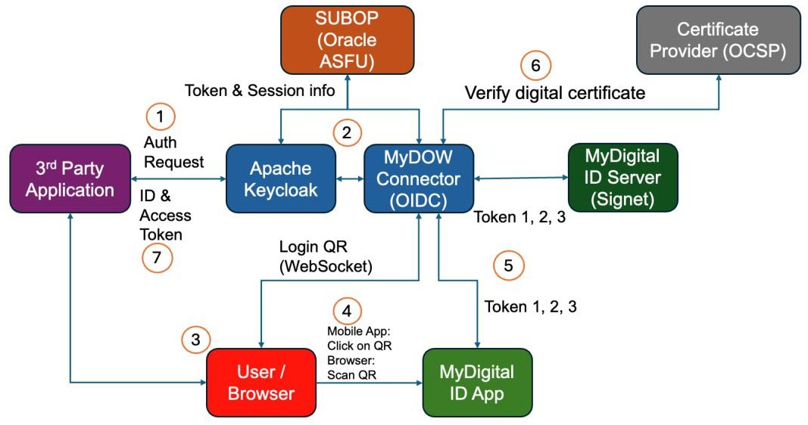
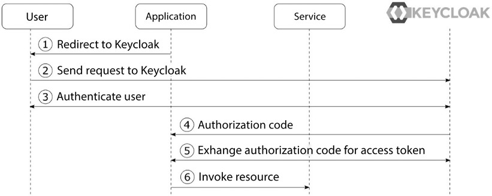
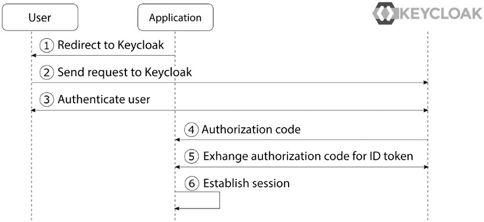
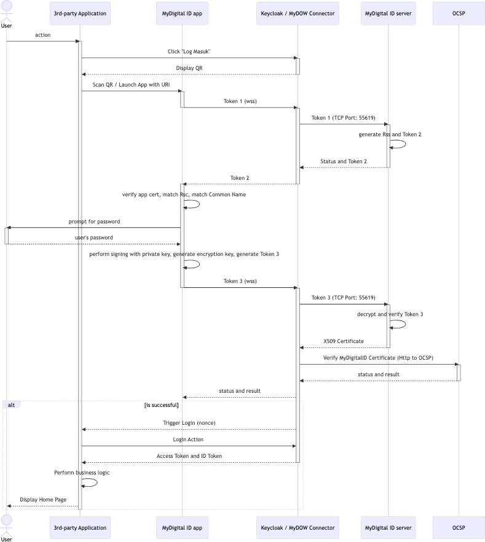

<br><br><br>

<div align="center">

  <h1>Single Sign-On Platform for<br>MyDigital ID</h1>
  <h2>SSO Integration Guideline</h2>
  <h3>Document</h3>

<br>

| **Date** | 14/7/2025 |
| --------- | --------- |
| **Version** | 2.0       |

<br>


<br>

</div>

<br><br><br>

---

### **Table of Contents**

- [List of Tables](#list-of-tables)
- [List of Figures](#list-of-figures)
- [Acronyms and Abbreviations](#acronyms-and-abbreviations)
- [Glossary/ Definition](#glossary-definition)
- [SECTION 1: SYSTEM OVERVIEW](#section-1-system-overview)
  - [System Overview](#system-overview)
    - [SSO Integration](#sso-integration)
    - [System Architecture](#system-architecture)
      - [System Architecture Flow](#system-architecture-flow)
    - [MyDigital ID SSO Platform](#mydigital-id-sso-platform)
    - [Keycloak SSO Protocol](#keycloak-sso-protocol)
      - [OAuth 2.0](#oauth-2.0)
      - [OpenID Connect](#openid-connect)
    - [MyDigital ID SSO Protocol Sequence](#mydigital-id-sso-protocol-sequence)
      - [MyDigital ID SSO Protocol Sequence Components](#mydigital-id-sso-protocol-sequence-components)
    - [MyDigital ID SSO Keycloak Client](#mydigital-id-sso-keycloak-client)
      - [MyDigital ID SSO Keycloak Client Configuration](#mydigital-id-sso-keycloak-client-configuration)
      - [Client Flow in MyDigital ID SSO Keycloak](#client-flow-in-mydigital-id-sso-keycloak)
      - [Example of Client Flow in MyDigital ID SSO Keycloak Use Cases](#example-of-client-flow-in-mydigital-id-sso-keycloak-use-cases)
- [SECTION 2: WEB LOGIN, MOBILE APP SSO INTEGRATION AND DEVELOPER GUIDE](#section-2-web-login-mobile-app-sso-integration-and-developer-guide)
  - [3rd Party Application Integration with MyDigital ID Keycloak SSO Integration](#rd-party-application-integration-with-mydigital-id-keycloak-sso-integration)
  - [MyDigital ID SSO Integration Checklist](#mydigital-id-sso-integration-checklist)
  - [Library for Keycloak SSO Integration](#library-for-keycloak-sso-integration)
  - [Keycloak Configuration](#keycloak-configuration)
    - [Endpoint](#endpoint)
  - [Developer Guide for SSO Integration](#developer-guide-for-sso-integration)
    - [PHP 7 with Laravel Framework](#php-7-with-laravel-framework)
      - [Environment Configuration](#environment-configuration)
      - [Library Installation](#library-installation)
      - [Add Keycloak Driver](#add-keycloak-driver)
      - [Create redirectToKeycloak Function](#create-redirecttokeycloak-function)
      - [Create handleKeycloakCallback Function](#create-handlekeycloakcallback-function)
      - [Add IC Number Column in Model](#add-ic-number-column-in-model)
      - [Add New Routes](#add-new-routes)
    - [PHP 8 with Laravel Framework](#php-8-with-laravel-framework)
      - [Environment Configuration](#environment-configuration-1)
      - [Library Installation](#library-installation-1)
      - [Configure Return Variable](#configure-return-variable)
      - [Add Keycloak Driver](#add-keycloak-driver-1)
      - [Create redirectToKeycloak Function](#create-redirecttokeycloak-function-1)
      - [Create getAccessTokenFromKeycloak Function](#create-getaccesstokenfromkeycloak-function)
      - [Create getUserInfoFromKeycloak Function](#create-getuserinfofromkeycloak-function)
      - [Create handleKeycloakCallback Function](#create-handlekeycloakcallback-function-1)
      - [Add IC Number Column in Model](#add-ic-number-column-in-model-1)
      - [Create updateICNumber Function](#create-updateicnumber-function)
      - [Create verifyAndLinkAccount Function](#create-verifyandlinkaccount-function)
      - [Create registerNewAccount Function](#create-registernewaccount-function)
      - [Add New Routes](#add-new-routes-1)
    - [PHP 8 with CodeIgniter Framework](#php-8-with-codeigniter-framework)
      - [Environment Configuration](#environment-configuration-2)
      - [Library Installation](#library-installation-2)
      - [Create loginWithKeycloak Function](#_bookmark86)
      - [Create getAccessToken Function](#_bookmark88)
      - [Create getUserInfo Function](#create-getuserinfo-function)
      - [Create keycloakCallback Function](#_bookmark92)
      - [Add IC Number Column in Model](#add-ic-number-column-in-model-2)
      - [Create update_user Function](#_bookmark99)
      - [Create linkAccount Function](#_bookmark101)
      - [Create registerWithKeycloak Function](#_bookmark103)
      - [Add New Routes](#add-new-routes-2)
    - [PHP 7 with CodeIgniter Framework](#php-7-with-codeigniter-framework)
      - [Configuration Setup](#configuration-setup)
      - [Library Installation](#library-installation-3)
      - [Create New Construct](#create-new-construct)
      - [Create login Function](#_bookmark114)
      - [Create callback Function](#_bookmark116)
      - [Create show_modal_options Function](#_bookmark120)
      - [Create link_existing_account Function](#_bookmark122)
      - [Create register_new_account Function](#_bookmark124)

---

### List of Tables

- [Table 1: Application Survey Form](#_bookmark26)
- [Table 2: List of Libraries for SSO Integration](#_bookmark28)
- [Table 3: Keycloak Configuration Example](#_bookmark30)
- [Table 4: Endpoint List](#_bookmark32)

---

### List of Figures

- [Figure 1: System Architecture](#_bookmark8)
- [Figure 2: Simplified OAuth 2.0 Authorization Code Grant Type](#figure-2-simplified-oauth-2.0-authorization-code-grant-type)
- [Figure 3: Simplified OpenID Connect Authorization Code Flow](#figure-3-simplified-openid-connect-authorization-code-flow)
- [Figure 4: MyDigital ID SSO Protocol Sequence Diagram](#_bookmark17)
- [Figure 5: Environment Configuration in PHP Laravel](#_bookmark36)
- [Figure 6: Keycloak Guard Library Installation](#_bookmark38)
- [Figure 7: Keycloak Driver](#_bookmark40)
- [Figure 8: redirectToKeycloak Function](#_bookmark42)
- [Figure 9: handleKeycloakCallback Function](#_bookmark44)
- [Figure 10: Retrieve User Information](#_bookmark45)
- [Figure 11: Finds IC Number and Stored in The Database](#_bookmark46)
- [Figure 12: Add IC Number Column](#_bookmark48)
- [Figure 13: Add New Routes](#_bookmark50)
- [Figure 14: Environment Configuration in PHP Laravel](#_bookmark53)
- [Figure 15: Keycloak Guard Library Installation](#_bookmark55)
- [Figure 16: Configure the Return Variable](#_bookmark57)
- [Figure 17: Keycloak Driver](#_bookmark59)
- [Figure 18: redirectToKeycloak Function](#_bookmark61)
- [Figure 19: getAccessTokenFromKeycloak Function](#_bookmark63)
- [Figure 20: getUserInfoFromKeycloak Function](#_bookmark65)
- [Figure 21: handleKeycloakCallback Function](#_bookmark67)
- [Figure 22: Retrieve User Information](#_bookmark68)
- [Figure 23: Verify IC Number](#_bookmark69)
- [Figure 24: Verify IC Number with The Hashed Value Stored in The Database](#_bookmark70)
- [Figure 25: Add IC Number Column](#_bookmark72)
- [Figure 26: updateICNumber Function](#_bookmark74)
- [Figure 27: verifyAndLinkAccount Function](#_bookmark76)
- [Figure 28: registerNewAccount Function](#_bookmark78)
- [Figure 29: Add New Routes](#_bookmark80)
- [Figure 30: Environment Configuration in PHP Laravel](#_bookmark83)
- [Figure 31: openid-connect-php Library Installation](#_bookmark85)
- [Figure 32: loginWithKeycloak Function](#_bookmark87)
- [Figure 33: getAccessToken Function](#_bookmark89)
- [Figure 34: getUserInfo Function](#_bookmark91)
- [Figure 35: keycloakCallback Function](#figure-35-keycloakcallback-function)
- [Figure 36: Fetch userInfo](#_bookmark94)
- [Figure 37: Store User Data](#_bookmark95)
- [Figure 38: Verify IC Number](#_bookmark96)
- [Figure 39: Add IC Number Column](#_bookmark98)
- [Figure 40: update_user Function](#_bookmark100)
- [Figure 41: linkAccount Function](#_bookmark102)
- [Figure 42: registerWithKeycloak Function](#_bookmark104)
- [Figure 43: Add New Routes](#_bookmark106)
- [Figure 44: Setup Configuration](#_bookmark109)
- [Figure 45: oauth2-client Library Installation](#_bookmark111)
- [Figure 46: Add New Construct](#_bookmark113)
- [Figure 47: login Function](#_bookmark115)
- [Figure 48: callback Function](#_bookmark117)
- [Figure 49: Fetch User Information](#_bookmark118)
- [Figure 50: Verify IC Number](#_bookmark119)
- [Figure 51: show_modal_options Functions](#_bookmark121)
- [Figure 52: link_existing_account Function](#_bookmark123)
- [Figure 53: register_new_account Function Part 1](#_bookmark125)
- [Figure 54: register_new_account Function Part 2](#_bookmark126)

---

### Acronyms and Abbreviations

| Acronym/ Abbreviation | Definition                                                 |
| --------------------- | ---------------------------------------------------------- |
| **API** | Application Programming Interface                          |
| **DB** | Database                                                   |
| **DNS** | Domain Name System                                         |
| **Https** | HyperText Transfer Protocol Secure                         |
| **ID** | Identification                                             |
| **IdP** | Secure Identity Provider                                   |
| **JWT** | JSON Web Token                                             |
| **JSON** | JavaScript Object Notation                                 |
| **OAuth** | OAuth 2.0: An open-standard protocol for secure and delegated authorization. |
| **OIDC** | OpenID Connect                                             |
| **QR** | Quick Response                                             |
| **RSC** | Resource Security Code                                     |
| **SSO** | Single Sign On                                             |
| **TLS** | Transport Layer Security                                   |
| **TCP/IP** | Transmission Control Protocol/ Internet Protocol         |

---

### Glossary/ Definition

| Glossary                | Definition                                                                                                   |
| ----------------------- | ------------------------------------------------------------------------------------------------------------ |
| **.NET MAUI** | A cross-platform framework developed by Microsoft for building native applications for iOS, Android, macOS, and Windows using a single codebase. |
| **3rd Party Application** | Application that does not currently support MyDigital ID integration, but is the target for future MyDigital ID SSO implementation. |
| **Client Component** | External Third-Party Application client side.                                                                |
| **Dart** | A programming language developed by Google, designed for client-side development to build fast, modern apps for web, mobile, and desktop platforms. |
| **Flutter** | An open-source UI software development kit created by Google, used to develop cross-platform applications for Android, iOS, and web. |
| **Ionic** | An open-source framework for building cross-platform mobile applications using web technologies such as HTML, CSS, and JavaScript. |
| **Java** | A high-level, object-oriented programming language that is widely used for building cross-platform applications. |
| **Keycloak Cluster (OIDC Provider)** | Cloud application services consist of a group of interconnected computers that work together to perform identity and access management solutions. |
| **Kotlin** | An open-source programming language developed by JetBrains, designed to interoperate seamlessly with Java and run on the Java Virtual Machine (JVM). |
| **MyDigital ID Mobile Application** | Mobile Application contains MyDigital ID.                                                       |
| **MyDigital ID Server** | MyDigital ID Server that provides ID Authentication.                                                          |
| **MyDigital ID SSO Server** | MyDigital ID Single Sign On Server.                                                                        |
| **Node.js** | A JavaScript runtime built on Chrome's V8 JavaScript engine, allowing developers to run JavaScript on the server side to build scalable, high-performance applications. |
| **OAuth 2.0** | An open-standard protocol for authorization that enables secure delegated access to resources without sharing credentials. |
| **OpenID Connect (OIDC)** | A protocol built on top of OAuth 2.0 that adds identity verification capabilities, allowing applications to confirm the identity of a user. |
| **PHP** | An open-source scripting language primarily designed for web development.                                  |
| **Python** | A popular high-level programming language known for its simple syntax and extensive libraries, widely used in web development, data science, and automation. |
| **Progressive Web App (PWA)** | A web-based application designed to function like a native app on any device, offering features such as offline functionality and push notifications. |
| **React** | A popular JavaScript library for building user interfaces, particularly for single-page applications.        |
| **Session** | A temporary and secure connection between a user and the application, established after authentication and valid until the session expires or the user logs out. |
| **Signet Cluster** | Cloud application services consist of a group of interconnected computers that work together to perform MyDigital ID Authentication. |
| **Swift** | An open-source programming language developed by Apple for building applications across the Apple ecosystem, including **iOS**, **macOS**, **watchOS**, and **tvOS**. |
| **Third Party Application** | A software application created by a developer or company intent to integrate with MyDigital ID.          |
| **Token** | A digital artifact used to represent the authentication state of a user. Tokens are typically short-lived, digitally signed, and include claims such as user identity and expiration time. |
| **User** | The user in the client sends a request to the web server hosting the site.                                   |
| **Websocket Cluster** | Cloud application services consist of a group of interconnected computers that work together to perform bidirectional communication with Signet Cluster. |

---

## SECTION 1: SYSTEM OVERVIEW

### System Overview

#### SSO Integration

SSO Integration uses Keycloak, an open-source Identity and Access Management (IAM) for modern apps like single-page applications, mobile apps, and REST APIs. The services provided to facilitate the integration of SSO include:

-   **Authentication**: Centralized login service to verify user identities
-   **Authorization**: Role-based and implements detailed access control for applications
-   **Token Management**: Issuance and validation of tokens using OpenID Connect protocol.
-   **User Federation**: Integration with external user directories like LDAP, Active Directory and more.

#### System Architecture

<a id="_bookmark8"></a>
<div align="center">



**Figure 1: System Architecture**

</div>

#### System Architecture Flow

1.  The user will go to the Login Page in the 3rd party application. The 3rd party application will be redirected to the Keycloak.
2.  Keycloak then will be redirected to MyDOW Connector (OIDC).
3.  MyDOW Connector will generate a unique QR Code and will display it to the user.
4.  The user clicks the QR Code (mobile) or scans the QR Code (browser) and authenticates using the MyDigital ID application.
5.  MyDigital ID application connects to MyDOW Connector and performs 3-way handshaking.
6.  On the 3rd handshake, MyDOW Connector will receive the user certificate and check the certificate with OCSP.
7.  MyDOW connector will return the auth token to Keycloak and Keycloak will return the token to the 3rd party application.

#### MyDigital ID SSO Platform

MyDigital ID SSO platform consists of the Identity and Access Management (IAM) platform on the frontend that supports OAuth 2.0 and OpenID Connect. Keycloak provides the functionality to manage authentication client secret, authentication flow behavior and other operational elements that is required by OAuth 2.0 and OIDC to function.

MyDOW OIDC Connector plugin is a purpose-built plugin that was developed to interface OIDC with the mechanism that performs 3-way handshaking of MyDigital ID (refer to MyDigital ID Integration Guideline Document). In essence, MyDOW OIDC connector is presented as an Identity Provider to Keycloak.

#### Keycloak SSO Protocol

Keycloak uses industry-standard protocols like OAuth 2.0 and OpenID Connect secure authentication and authorization. Using industry-standard protocols is crucial not only for ensuring robust security but also for simplifying integration with both existing and new applications.

#### OAuth 2.0

With OAuth 2.0, sharing user data to third-party applications is easy, does not require sharing user credentials, and allows control over what data is shared. Four (4) roles defined in OAuth 2.0:

-   **Resource owner**: The end user that owns resources that an application wants to access.
-   **Resource server**: The service hosting the protected resources.
-   **Client**: The application that would like to access the resource.
-   **Authorization server**: The server issuing access to the client, which is the role of Keycloak.

In an OAuth 2.0 protocol flow, the client requests access to a resource on behalf of a resource owner from the authorization server. The authorization server issues limited access to the resource at the resource server by including access token in the request.

<a id="figure-2-simplified-oauth-2.0-authorization-code-grant-type"></a>
<div align="center">



**Figure 2: Simplified OAuth 2.0 Authorization Code Grant Type**

</div>

The steps in the diagram are as follows:

1.  The application sends an authentication request to the user's browser to be redirected to Keycloak for authorization.
2.  The browser redirects the user to Keycloak's authorization page.
3.  If the user is not authenticated with Keycloak, Keycloak authenticates the user
4.  The application gets an authorization code from Keycloak.
5.  The application then exchanges the code for an access token from Keycloak.
6.  The application uses the access token to access the protected resource.

Access tokens are passed around from the application to services, usually having a short lifetime. To get new access tokens without repeating the whole process, a refresh token is used.

#### OpenID Connect

Since OAuth 2.0 is for authorization, but not authentication, OpenID Connect adds an authentication layer on top of OAuth 2.0. OpenID Connect has enabled a whole ecosystem of websites to no longer need to deal with user management and authenticating users. OpenID Connect is useful to have a centralized solution for authentication supporting single sign-on and increases security as applications do not have access to the user credentials directly. Furthermore, it enables the use of stronger authentication, such as OTP or WebAuthn, without the need to support it directly within applications.

OpenID Connect (OIDC) involves three (3) main roles in its protocol:

1.  **End user**: It is the same as the resource owner in OAuth 2.0. This is simply the human being who is logging in or being authenticated.
2.  **Relying Party (RP):** The application or website that needs to verify or authenticate the end user.
3.  **OpenID Provider (OP):** The identity provider that is authenticating the user, which is the role of Keycloak.

In OpenID Connect, the RP asks the OP for the user's identity and can also obtain a token since it builds on OAuth 2.0. OpenID Connect uses OAuth 2.0's Authorization Code grant but adds `scope=openid` to make it an **authentication request** instead of just an **authorization request**. There are two (2) flows in OpenID Connect:

1.  **Authorization code flow**: This follows the OAuth 2.0 Authorization Code flow, returning an authorization code that can be exchanged for an ID token, access token, and refresh token.
2.  **Hybrid flow**: The ID token and authorization code are returned together in the initial request.

<a id="figure-3-simplified-openid-connect-authorization-code-flow"></a>
<div align="center">



**Figure 3: Simplified OpenID Connect Authorization Code Flow**

</div>

The steps in the diagram are as follows:

1.  The app prepares a request to authenticate and asks the user's browser to be redirected to Keycloak.
2.  The browser redirects the user to Keycloak's login page (authorization endpoint).
3.  If the user is not logged in yet, Keycloak will ask them to log in.
4.  The app gets an authorization code from Keycloak as a response.
5.  The app then exchanges this authorization code with Keycloak for an ID token and an access token.
6.  The app uses the ID token to identify the user and start a logged-in session.

#### MyDigital ID SSO Protocol Sequence

<a id="_bookmark17"></a>
<div align="center">



**Figure 4: MyDigital ID SSO Protocol Sequence Diagram**

</div>

##### MyDigital ID SSO Protocol Sequence Components

**Components:**

1.  **User**: The end-user requesting access to resources.
2.  **3rd-Party Application (App)**: The client application consists of a mobile application or web application that the user interacts with.
3.  **MyDigitalID App**: An app responsible for verifying users and generating tokens.
4.  **Keycloak/MyDOW Cluster (OIDC Provider)**: The OpenID Connect (OIDC) provider for handling authentication.
5.  **WebSocket Cluster (WSS)**: Manages WebSocket connections for real-time communication.
6.  **Signet Cluster**: Handles secure token verification and status updates.

##### Flow Explanation:

1.  **User Request**
    -   The user makes a request to the application for a resource, but there is no prior authentication.

2.  **Redirect to Keycloak**
    -   The application redirects the user to Keycloak for authentication.
    -   Keycloak detects the Mydigital ID Identity Provider as the IDP stated in the authentication flow of the client.
    -   Keycloak redirects requests to MyDigital MyDOW IDP which then produces the unique nonce and generates the MyDigital ID QR code to be scanned and application url link to Signet server if the QR is clicked.

3.  **Action and Token Generation**
    -   The user performs an action by scanning using MyDigital ID app (Desktop web app) or click on the QR code (Mobile app or Mobile PWA)
    -   MyDigitalID commence the MyDigital ID authentication protocol (3- way handshaking)

4.  **WebSocket Initiation**
    -   While the MyDigital ID app is bound to the websocket server, the 3rd party application is also connected with the Websocket Connections. The connections from the 3rd party application will join a channel determined by the nonce.
    -   The Two apps, 3rd party login and my Digital ID websocket login are bound by the nonce websocket channel.

5.  **Final Token Generation and Authentication**
    -   Once the 3-way handshaking process is accomplished (includes the password verification), a JWT Token is responded to Keycloak.
    -   The JWT Token responded by MyDOW OIDC to Keycloak will consist of full name and IC Number.
    -   Once Keycloak receives the JWT Token, Keycloak will take the claims (fullname and IC Number) and incorporate the info into a newly generated JWT token to be returned to the initiator client.

6.  **Resource Access**
    -   The user accesses the application with the JWT token.
    -   The application validates the token with Keycloak.
    -   Upon successful validation, Keycloak informs the application, and the application provides access to the requested resources.

#### MyDigital ID SSO Keycloak Client

A Keycloak client is an application or service that interacts with Keycloak for authentication and authorization. In Keycloak, a "client" can be any system that integrates with Keycloak to use its identity management capabilities, such as single sign-on (SSO), user authentication, and role-based access control (RBAC).

Keycloak clients are typically web applications, mobile applications, or even backend services that use Keycloak to authenticate users and obtain access tokens, or they could be microservices that need to secure their APIs.

##### MyDigital ID SSO Keycloak Client Configuration

When configuring a Keycloak client, you usually specify the following settings:

1.  **Client ID**: A unique identifier for the client within Keycloak. This is how Keycloak knows which client is making a request.
2.  **Client Secret**: A secret key used for secure communication between the client and Keycloak (in the case of confidential clients).
3.  **Redirect URI**: The URL to which Keycloak will redirect the user after successful authentication. This is typically the URL of the application that the user is trying to access.
4.  **Protocol**: The authentication protocol used by the client. Common protocols include:
    -   **OpenID Connect** (OIDC) -- A modern protocol based on OAuth 2.0, commonly used for web and mobile applications.
    -   **OAuth 2.0** -- A framework for access delegation, widely used for authorization.
5.  **Access Type**:
    -   **Confidential**: Clients that can securely store credentials (e.g., server-side applications). These clients authenticate themselves to Keycloak using client secrets.
    -   **Public**: Clients that cannot securely store credentials (e.g., single-page applications, mobile apps).
    -   **Bearer-only**: Clients that only accept access tokens and cannot initiate authentication themselves. Common for APIs or resource servers.
6.  **Roles and Scopes**: The permissions or access levels that the client can request, often used to limit or specify access to certain resources or actions.

##### Client Flow in MyDigital ID SSO Keycloak

1.  A user accesses a client application and is redirected to Keycloak for authentication.
2.  Keycloak authenticates the user (e.g., through login credentials, social login, etc.).
3.  After successful authentication, Keycloak sends an authorization code or access token back to the client application (depending on the flow used).
4.  The client can use the token to make authorized API calls, or the token can be stored for the duration of the session.

##### Example of Client Flow in MyDigital ID SSO Keycloak Use Cases

-   **Web Application**: A client in Keycloak could represent a React or Angular app that interacts with a backend API to fetch user data after authentication.
-   **Mobile App**: A client could represent a mobile app that needs to authenticate users via Keycloak and interact with a REST API.
-   **Service-to-Service Communication**: A client could also be a backend service that needs to authenticate itself when calling other services or APIs.

In summary, a MyDigital ID SSO Keycloak client is a representation of an application or service that uses Keycloak for handling authentication and authorization, with various settings and protocols to define its interaction with Keycloak's identity management features.

---

## SECTION 2: WEB LOGIN, MOBILE APP SSO INTEGRATION AND DEVELOPER GUIDE

### 3rd Party Application Integration with MyDigital ID Keycloak SSO Integration

Integration with MyDigital ID Keycloak SSO is usually done by incorporating standard open source libraries that are readily available on various platforms. These libraries are usually maintained by the open source community, most often up to date with features and security patches. This method is recommended because it will reduce development time and be more stable due to the fact that they are being used widely by the community. The following section will outline the necessary task required to accomplish such integration with examples towards the end.

### MyDigital ID SSO Integration Checklist

Below is a list of information(s) that is needed for us to assess the compatibility and support feature of the current 3rd party application with the MyDigital ID SSO platform. Assessment is primarily needed to assess if the current web or application framework has a standard Keycloak library that will reduce development time or custom development for the authentication protocols aforementioned which will extend development time.

<a id="_bookmark26"></a>
**Table 1: Application Survey Form**

| # | Item | Description |
| :-: | :-- | :--- |
| 1 | Application Survey Form | A third-party application product owner MUST provide us the details of the software framework used and send Application form email to <sso@myid.my> to request the integration. <br><br> The Application Survey Form should include the following details: <br> - Apps: <br> - Language: <br> - Language Version: <br> - Framework: <br> - Framework Version: <br> - OS: <br> - OS Version: <br> - DB: <br> - DB Version: <br> - Authentication Type: <br> - Public App/Internal App: Warganegara /Bukan Warganegara / Staff/Orang Awam |

### Library for Keycloak SSO Integration

Below is a list of libraries that supports Keycloak SSO Integration with the suitable Programming Language and framework. The website or application environment must meet the required language and framework versions before installing the library.

<a id="_bookmark28"></a>
**Table 2: List of Libraries for SSO Integration**

| Language | Language Version | Framework | Framework Version | Library | Library Version |
| :--- | :--- | :--- | :--- | :--- | :--- |
| **Node.js** | 12.x, 14.x | Express.js | 4.x | keycloak-connect | 11.x |
| | 16.x+ | Express.js | 4.x | keycloak-connect | > 12.x |
| | 14.x+ | NestJS | 7.x to 9.x | nest-keycloak-connect | > 2.x |
| | 16.x+ | NestJS | 10.x | nest-keycloak-connect | > 3.x |
| **Java** | 8+ | Spring Boot | 2.x | spring-boot-starter-oauth2-client | > 2.x |
| | 11+ | Spring Boot | 2.x | spring-security-oauth2 | > 5.x |
| | 8+ | Java EE (Jakarta EE) | 8.x | keycloak-java-adapter | > 1.x |
| | 4+ | Quarkus | 1.x | keycloak-authorization | > 1.x |
| **Python** | 3.6+ | Flask | 1.x to 2.x | flask-oauthlib | > 0.9 |
| | 3.6+ | Django | 3.x | django-oauth-toolkit | > 1.x |
| | 3.6+ | FastAPI | 0.68+ | fastapi-keycloak | > 1.x |
| **PHP** | 8.1+ | Laravel | 10.x | laravel-keycloak-guard | > 3.x |
| | 8.0+ | Laravel | 9.x | laravel-keycloak-guard | > 2.x |
| | 7.4+ | Laravel | 7.x to 8.x | laravel-keycloak-guard | > 2.x |
| | 7.0+ | Codeigniter | 3.x | oauth2-client | > 1.x |
| | 7.4+ | Codeigniter | 3.x | oauth2-client | > 2.x |
| | 8.0+ | Codeigniter | 4.x | openid-connect-php | > 3.x |
| | 7.4+ | Symfony | 4.x | knpuniversity/oauth2-client | > 2.x |
| **React** | 17.x+ | Next.js | 10.x+ | next-auth (Keycloak provider) | 3.x+ |
| | 16.x+ | Gatsby | 3.x+ | gatsby-plugin-keycloak | 1.x |
| **.NET MAUI** | 6.x+ | Xamarin | 5.x+ | Xamarin.Auth | > 1.x+ |
| **Ionic** | 6.x+ | Angular | 11.x+ | angular-oauth2-oidc | > 11.x+ |
| **Swift** | 5.x+ | SwiftUI | 2.x+ | OAuthSwift | > 2.x+ |
| **Kotlin** | 1.4+ | Spring Boot | 2.x+ | spring-security-oauth2-client | 5.x+ |
| | 1.4+ | Ktor | 2.x+ | ktor-client-auth | 2.x+ |
| **Dart** | 2.x+ | Flutter | 2.x+ | flutter_appauth | > 0.9.x+ |
| | 2.x+ | AngularDart | 6.x+ | angular_oauth2 | > 6.x+ |
| | 2.x+ | Aqueduct | 4.x+ | aqueduct_auth | > 4.x+ |

### Keycloak Configuration

The configuration of Keycloak for an application or website is managed through the Keycloak Admin Console, which provides a user-friendly interface for setting up and maintaining Keycloak's integration. This console allows administrators to configure various components necessary for the secure authentication and authorization of users. Below is a comprehensive list of configurations required to integrate Keycloak into the application or website, ensuring that user access is properly controlled and authenticated in accordance with the desired security policies.

<a id="_bookmark30"></a>
**Table 3: Keycloak Configuration Example**

| Field | Description |
| :--- | :--- |
| **KEYCLOAK_CLIENT_ID** | `<Client_ID>` |
| **KEYCLOACK_CLIENT_SECRET** | `NUxxxxxxxxxxxxxx` |
| **KEYCLOACK_REDIRECT_URI** | `http://127.0.0.1:8000/callback` |
| **KEYCLOACK_BASE_URL** | `<MyDigital ID SSO DNS host>` |
| **KEYCLOCK_REALM** | `mydid` |
| **KEYCLOACK_URL_AUTHORIZE** | `https://<MyDigital ID SSO DNS host>/realms/mydid/protocol/openid-connect/auth` |
| **KEYCLOACK_URL_ACCESS_TOKEN** | `https://<MyDigital ID SSO DNS host>/realms/mydid/protocol/openid-token` |
| **KEYCLOACK_URL_USER_INFO** | `https://<MyDigital ID SSO DNS host>/realms/mydid/protocol/openid-connect/userinfo` |

#### Endpoint

<a id="_bookmark32"></a>
**Table 4: Endpoint List**

| Endpoint Name | Description | Example URL: MyDigital ID SSO DNS host |
| :--- | :--- | :--- |
| **Authorization Endpoint** | Used to obtain an authorization code or implicit access token via user authentication | `https://<MyDigital ID SSO DNS host>/auth/realms/{realm}/protocol/openid-connect/auth` |
| **Token Endpoint** | Used to exchange authorization codes, refresh tokens, or client credentials for access tokens | `https://<MyDigital ID SSO DNS host>/auth/realms/{realm}/protocol/openid-connect/token` |
| **Userinfo Endpoint** | Returns claims (user profile information) about the authenticated user. | `https://<MyDigital ID SSO DNS host>/auth/realms/{realm}/protocol/openid-connect/userinfo` |
| **Logout Endpoint** | Allows users to log out and revoke their session. | `https://<MyDigital ID SSO DNS host>/auth/realms/{realm}/protocol/openid-connect/logout` |
| **JWKS Endpoint** | Provides the public keys used to verify JSON Web Tokens (JWTs) | `https://<MyDigital ID SSO DNS host>/auth/realms/{realm}/protocol/openid-connect/certs` |

### Developer Guide for SSO Integration

#### PHP 7 with Laravel Framework

> This configuration guide is specifically applicable to **PHP v7.4.33** and **Laravel framework v8.83.29**. It is important to note that this guide may not be universally compatible with all PHP or Laravel versions. Developers should verify that their environment, including libraries, programming language, and framework versions, aligns with these requirements to ensure successful implementation.

##### Environment Configuration

Keycloak is configured in the `.env` file. This allows easy management of Keycloak configuration without hardcoding sensitive information in the application code:

<a id="_bookmark36"></a>

```
KEYCLOAK_BASE_URL=MydigitalID_host
KEYCLOAK_REALM=mydid
KEYCLOAK_CLIENT_ID=Client ID
KEYCLOAK_CLIENT_SECRET=NUxxxxxxxxxxxxxxxxxxxxxxxxxxxxxxxxxx
KEYCLOAK_REDIRECT_URI=http://127.0.0.1:8000/callback 
```

<div align="center">
  
**Figure 5: Environment Configuration in PHP Laravel**

</div>

##### Library Installation

Install the Keycloak Guard library in the Laravel project folder.

<a id="_bookmark38"></a>

```
composer require robsontenorio/laravel-keycloak-guard
```

<div align="center">

**Figure 6: Keycloak Guard Library Installation**

</div>

##### Add Keycloak Driver

Add the configuration for the Keycloak driver in the `auth.php` file to define Keycloak as an authentication provider for the application.

<a id="_bookmark40"></a>

```
'keycloak' => [
    'driver' => 'keycloak-web',
    'provider' => 'users',
],
```

<div align="center">

**Figure 7: Keycloak Driver**

</div>

##### Create redirectToKeycloak Function

In the `LoginController.php` file, create the `redirectToKeycloak` function. This function redirects users to the Keycloak Authorization Endpoint to start the login process. It is a key step in integrating Keycloak with a PHP application using the OAuth2 or OpenID Connect protocols, ensuring secure and seamless user authentication.

<a id="_bookmark42"></a>

```
public function redirectToKeycloak()
{
    return redirect(env('KEYCLOAK_BASE_URL'). "/realms/" .env("KEYCLOAK_REALM") . "/protocol/
    openid-connect/auth? . http_build_query([
        'client_id      => env('KEYCLOAK_CLIENT_ID),
        'redirect_uri'  => env('KEYCLOAK_REDIRECT_URI'),
        'response_type  => 'code',
        'scope'         => 'openid profile email',
    ]));
}
```

<div align="center">

**Figure 8: redirectToKeycloak Function**

</div>

##### Create handleKeycloakCallback Function

In the `LoginController.php` file, create a `handleKeycloakCallback` function. This function processes the Keycloak callback by exchanging the authorization code for an access token, enabling secure user authentication and access to protected resources.

<a id="_bookmark44"></a>

```
public function handleKeycloakCallback(Request $request)
{
    try {
        $tokenResponse = Http::asForm()->post(env('KEYCLOAK_BASE_URL') . "/realms/" . env
        ('KETCLOAK_REALM) . "/protocol/openid-connect/token", [
            'client_id'    => env('KEYCLOAK_CLIENT_ID'),
            'client_secret => env('KEYCLOAK_CLIENT_SECRET'),
            'redirect_uri' => env('KEYCLOAK_REDIRECT_URI'),
            'grant_type'   => 'authorization_code',
            'code'         => $request->code,
    ])->json();

    if (!isset($tokenResponse['access_token'])) return redirect('/login')->withErrors('Login failed. ');
    }
}
```

<div align="center">

**Figure 9: handleKeycloakCallback Function**

</div>

Retrieve the user information using the access token by querying the Keycloak User Info endpoint. Extract the IC number and name from the response to securely access and utilize these details within the application for user identification and processing.

<a id="_bookmark45"></a>

```
$userInfo = Http::withToken($tokenResponse['access_token'])->get(env('KEYCLOAK_BASE_URL') . "/
realms/" . env('KEYCLOAK_REALM') . "/protocol/openid-connect/userinfo")->json();
if (!$userInfo || !isset($userInfo['nric'])) return redirect('/login')->withErrors('User data missing.');
```

<div align="center">

**Figure 10: Retrieve User Information**

</div>

Creates or updates the user in the database. Finds a user based on IC number and if the IC number is found, proceed to log the user in. If the IC number is not found or does not match, handle redirect to the login page with login error message.

<a id="_bookmark46"></a>

```
      $user = \App\Models\User::updateOrCreate(['ic_number' => $userInfo['nric']], ['name' => $userInfo
      ['nama']]);

      Auth::login($user);
      return redirect('/dashboard')->withErrors('Login error: ' . $e->getMessage());

  } catch (\Exception $e) {
      return redirect('/login')->withErrors('Login error: ' . $e->getMessage());
  }
}
```

<div align="center">

**Figure 11: Finds IC Number and Stored in The Database**

</div>

##### Add IC Number Column in Model

If the application or website does not store the IC number in the database, the developer can add the IC number column to the protected fillable section in the `User.php` file. This approach ensures that the IC number is securely managed and can be updated within the user model while maintaining data integrity.

<a id="_bookmark48"></a>

```
  protected $fillable = [
    'name',
    'password',
    'ic_number',
  ];
```

<div align="center">

**Figure 12: Add IC Number Column**

</div>

##### Add New Routes

Add the new routes for all the newly created functions in the `web.php` file to ensure proper routing for actions such as account login and callback.

<a id="_bookmark50"></a>

```
Route::get('/', function () {
    return view('welcome');
});

Route::view('/dashboard', 'dashboard')->middleware('auth');

Route::get('/login', [KeycloakController::class, 'redirectToKeycloak'])->name('login');
Route::get('/callback', [KeycloakController::class, 'handleKeycloakCallback'])->name('callback');
Route::get('/logout', [KeycloakController::class, 'logout'])->name('logout');
```

<div align="center">

**Figure 13: Add New Routes**

</div>

#### PHP 8 with Laravel Framework

> This configuration guide is specifically applicable to **PHP v8.1.25** and **Laravel framework v10.48.12**. It is important to note that this guide may not be universally compatible with all PHP or Laravel versions. Developers should verify that their environment, including libraries, programming language, and framework versions, aligns with these requirements to ensure successful implementation.

##### <a id="environment-configuration-1"></a>Environment Configuration

Keycloak is configured in the `.env` file. This allows easy management of Keycloak configuration without hardcoding sensitive information in the application code:

<a id="_bookmark53"></a>

```
KEYCLOAK_BASE_URL=MydigitalID_host
KEYCLOAK_REALM=mydid
KEYCLOAK_CLIENT_ID=Client ID
KEYCLOAK_CLIENT_SECRET=NUxxxxxxxxxxxxxxxxxxxxxxxxxxxxxxxxxx
KEYCLOAK_REDIRECT_URI=http://127.0.0.1:8000/callback 
```

<div align="center">

**Figure 14: Environment Configuration in PHP Laravel**

</div>

##### <a id="library-installation-1"></a>Library Installation

Install the Keycloak Guard library in the Laravel project folder.

<a id="_bookmark55"></a>

```
composer require robsontenorio/laravel-keycloak-guard
```

<div align="center">

**Figure 15: Keycloak Guard Library Installation**

</div>

##### Configure Return Variable

Configure the return variables in the `keycloak-web.php` file by retrieving the necessary values from the environment file.

<a id="_bookmark57"></a>

```
return [
    'base_url' => env('KEYCLOAK_BASE_URL'),
    'realm' => env(KEYCLOAK_REALM),
    'client_id' => env('KEYCLOAK_CLIENT_ID'),
    'client_secret' => env('KEYCLOAK_CLIENT_SECRET'),
    'redirect_uri' => env('KEYCLOAK_REDIRECT_URI'),
    'cache_openid' => false,
    'cache_openif_ttl' => 3600,
    'allowed_resources' => null,
    'user_provider_credential' => null,
    'append_decoded_token' => false,
    'allowed_resources' => null,
    'guzzle_options' => [],
];
```

<div align="center">

**Figure 16: Configure the Return Variable**

</div>

##### <a id="add-keycloak-driver-1"></a>Add Keycloak Driver

Add the configuration for the Keycloak driver in the `auth.php` file to define Keycloak as an authentication provider for the application.

<a id="_bookmark59"></a>

```
'keyloak' => [
    'driver' => 'keycloak-web',
    'provider' => 'users',
],
```

<div align="center">

**Figure 17: Keycloak Driver**

</div>

##### <a id="create-redirecttokeycloak-function-1"></a>Create redirectToKeycloak Function

In the `LoginController.php` file, create the `redirectToKeycloak` function. This function redirects users to the Keycloak Authorization Endpoint to start the login process. It is a key step in integrating Keycloak with a PHP application using the OAuth2 or OpenID Connect protocols, ensuring secure and seamless user authentication.

<a id="_bookmark61"></a>

```
public function redirectToKeycloak()
{
    $config = config('keycloak-web');
    $url = $config['base_url'] . '/realms/' . $config['realm'] . '/protocol/openid-connect/auth?' . http_build_query([
        'client_id' => $config['client_id'],
        'redirect_uri' => $config['redirect_uri'],
        'response_type' => 'code',
        'scope' => 'openid profile email',
        'state' => bin2hex(random_bytes(16)),
        'nonce' => bin2hex(random_bytes(16)),
        'prompt' => 'login',
    ]);
    return redirect($url);
}
```

<div align="center">

**Figure 18: `redirectToKeycloak` Function**

</div>

##### Create getAccessTokenFromKeycloak Function

In the LoginController.php file, implement the `getAccessTokenFromKeycloak` function. This function is responsible for exchanging the authorization code obtained during the authentication process with Keycloak for an access token.

<a id="_bookmark63"></a>

```
private function getAccessTokenFromKeycloak($code)
{
    $config = config('keycloak-web');
    $client = new \GuzzleHttp\Client();
    try {
        $response = $client->post($config['base_url'] . '/realms/' . $config['realm'] . '/protocol/openid-connect/token', [
            'form_params' => [
                'grant_type' => 'authorization_code',
                'client_id' => $config['client_id'],
                'client_secret' => $config['client_secret'],
                'code' => $code,
                'redirect_uri' => $config['redirect_uri'],
            ]
        ]);
        return json_decode($response->getBody()->getContents());
    } catch (\Exception $e) {
        return null;
    }
}
```

<div align="center">

**Figure 19: `getAccessTokenFromKeycloak` Function**

</div>

##### Create getUserInfoFromKeycloak Function

Create a function called `getUserInfoFromKeycloak` in the `LoginController.php` file. This method is to retrieve user information using an access token.

<a id="_bookmark65"></a>

```
private function getUserInfoFromKeycloak($token)
{
    $config = config('keycloak-web');
    $client = new \GuzzleHttp\Client();
    $response = $client->get($config['base_url'] . '/realms/' . $config['realm'] . '/protocol/openid-connect/userinfo', [
        'headers' => [
            'Authorization' => 'Bearer ' . $token->access_token,
        ]
    ]);
    return json_decode($response->getBody()->getContents());
}
```

<div align="center">

**Figure 20: `getUserInfoFromKeycloak` Function**

</div>

##### <a id="create-handlekeycloakcallback-function-1"></a>Create handleKeycloakCallback Function

In the `LoginController.php` file, create a `handleKeycloakCallback` function. This function processes the Keycloak callback by exchanging the authorization code for an access token, enabling secure user authentication and access to protected resources.

<a id="_bookmark67"></a>

```
public function handleKeycloakCallback(Request $request)
{
    $code = $request->input('code');
    if (!$code) {
        return redirect('/login')->withErrors(['error' => 'Authorization code not received.']);
    }

    $token = $this->getAccessTokenFromKeycloak($code);
    if (!$token) {
        return redirect('/login')->withErrors(['error' => 'Failed to retrieve access token from Keycloak.']);
    }

}
```

<div align="center">

**Figure 21: `handleKeycloakCallback` Function**

</div>

Retrieve the user information using the access token by querying the Keycloak User Info endpoint. Extract the IC number and name from the response to securely access and utilize these details within the application for user identification and processing.

<a id="_bookmark68"></a>

```
    $userInfo = $this->getUserInfoFromKeycloak($token);
    $nric = $userInfo->nric ?? null;
    $name = $userInfo->nama ?? 'New User';
    session(['nric' => $nric, 'name' => $name]);
```

<div align="center">

**Figure 22: Retrieve User Information**

</div>

Verify if the IC number exists in the users table by checking for a matching record. Ensure that the provided IC number is properly hashed and matches the stored hashed value for accurate user identification and secure authentication.

<a id="_bookmark69"></a>

```
    $user = User::whereNotNull('ic_number')->get()->filter(function ($user) use ($nric) {
        return Hash::check($nric, $user->ic_number);
    })->first();
```

<div align="center">

**Figure 23: Verify IC Number**

</div>

Verify if the provided IC number matches the hashed value stored in the database. If a match is found, proceed to log the user in. If the IC number is not found or does not match, handle the necessary steps for linking the user's account or initiating the registration process.

<a id="_bookmark70"></a>

```
    if ($user && Hash::check($nric, $user->ic_number)) {
        Auth::login($user);
        session()->regenerate();
        return redirect()->intended('dashboard');
    } else {
        if (!$user) {
            return redirect()->route('icnumber.notfound');
        } else {
            return redirect()->route('icnumber.link');
        }
    }
}
```

<div align="center">

**Figure 24: Verify IC Number with The Hashed Value Stored in The Database**

</div>

##### <a id="add-ic-number-column-in-model-1"></a>Add IC Number Column in Model

If the application or website does not store the IC number in the database, the developer can add the IC number column to the protected fillable section in the `User.php` file. This approach ensures that the IC number is securely managed and can be updated within the user model while maintaining data integrity.

<a id="_bookmark72"></a>

```
protected $fillable = [
    'name',
    'ic_number',
    'password',
    'role',
];
```

<div align="center">

**Figure 25: Add IC Number Column**

</div>

##### Create updateICNumber Function

Create an `updateICNumber` function in the `LoginController.php` file to retrieve the IC number from the session. This function will identify users who have not yet linked their IC number, update the user's record with the IC number, log the user in, and then redirect them to the dashboard.

<a id="_bookmark74"></a>

```
public function updateIcNumber(Request $request)
{
    $nric = session('nric');
    if ($request->input('action') === 'link_existing_account') {
        $user = Auth::user();
        if ($user) {
            $user->ic_number = Hash::make($nric); // Hash the IC number
            $user->save();
            session()->regenerate();
            return redirect()->intended('dashboard');
        }
    }
    return redirect()->route('login');
}
```

<div align="center">

**Figure 26: `updateICNumber` Function**

</div>

##### Create verifyAndLinkAccount Function

Create a `verifyAndLinkAccount` function in the `LoginController.php` file to validate the email and password input. The function will attempt to authenticate the user using the provided credentials. If authentication is successful, the IC number will be updated and linked to the user's account.

<a id="_bookmark76"></a>

```
public function verifyAndLinkAccount(Request $request)
{
    $request->validate([
        'email' => 'required|email',
        'password' => 'required',
    ]);
    
    $nric = session('nric');
    if (!$nric) {
        return redirect()->back()->withErrors(['nric' => 'NRIC data not found in session.']);
    }

    if (Auth::attempt(['email' => $request->email, 'password' => $request->password])) {
        $user = Auth::user();
        $user->ic_number = Hash::make($nric);
        $user->save();
        session()->regenerate();
        return redirect()->route('icnumber.link')->with('success', 'Account linked successfully!');
    } else {
        return redirect()->back()->withErrors(['email' => 'The provided credentials do not match our records.']);
    }
}
```

<div align="center">

**Figure 27: `verifyAndLinkAccount` Function**

</div>

##### Create registerNewAccount Function

Create a `registerNewAccount` function in the `LoginController.php` file to check if the IC number and name are in the session. If no user is found, a new account will be created, and the user will be redirected to the dashboard.

<a id="_bookmark78"></a>

```
public function registerNewAccount(Request $request)
{
    $nric = session('nric');
    $name = session('name') ?? 'New User';

    if (!$nric || !$name) {
        return redirect()->route('login')->withErrors(['nric' => 'IC number or name not found.']);
    }
    
    // Check if user already exists
    $existingUser = User::whereNotNull('ic_number')->get()->filter(function ($user) use ($nric) {
        return Hash::check($nric, $user->ic_number);
    })->first();

    if (!$existingUser) {
        $user = User::create([
            'name' => $name,
            'ic_number' => Hash::make($nric),
            'password' => bcrypt('default_password'), // Or generate a random one
        ]);
        Auth::login($user);
        session()->regenerate();
        return redirect()->intended('dashboard');
    }
    // Handle case where user somehow exists
    return redirect()->route('login')->withErrors(['error' => 'Account already exists.']);
}
```

<div align="center">

**Figure 28: `registerNewAccount` Function**

</div>

##### <a id="add-new-routes-1"></a>Add New Routes

Add the new routes for all the newly created functions in the `web.php` file to ensure proper routing for actions such as account registration, login, and IC number linking.

<a id="_bookmark80"></a>

```
// Keycloak login routes
Route::get('/login/keycloak', [LoginController::class, 'redirectToKeycloak'])->name('login.keycloak');
Route::get('/callback', [LoginController::class, 'handleKeycloakCallback'])->name('keycloak.callback');
Route::get('/logout', [LoginController::class, 'logout'])->name('logout');

// IC Number handling routes
Route::get('/icnumber/notfound', function () {
    return view('auth.icnumber_notfound'); // View for the not found modal
})->name('icnumber.notfound');

Route::get('/icnumber/link', function () {
    return view('auth.icnumber_link'); // View for linking the IC number
})->name('icnumber.link');

Route::post('/icnumber/update', [LoginController::class, 'updateIcNumber'])->name('icnumber.update');
Route::get('/register-new-account', [LoginController::class, 'registerNewAccount'])->name('register.new');
Route::post('/icnumber/verify-and-link', [LoginController::class, 'verifyAndLinkAccount'])->name('icnumber.verifyAndLink');
```

<div align="center">

**Figure 29: Add New Routes**

</div>

#### PHP 8 with CodeIgniter Framework

> This configuration guide is specifically applicable to **PHP v8.1.25** and **CodeIgniter framework v4.2.1**. It is important to note that this guide may not be universally compatible with all PHP and CodeIgniter versions. Developers should verify that their environment, including libraries, programming language, and framework versions, aligns with these requirements to ensure successful implementation.

##### <a id="environment-configuration-2"></a>Environment Configuration

Configure the keycloak configuration in the `.env` file:

<a id="_bookmark83"></a>

```
KEYCLOAK_BASE_URL=MydigitalID_host
KEYCLOAK_REALM=mydid
KEYCLOAK_CLIENT_ID=Client ID
KEYCLOAK_CLIENT_SECRET=NUxxxxxxxxxxxxxxxxxxxxxxxxxxxxxxxxxx
KEYCLOAK_REDIRECT_URI=http://127.0.0.1:8000/callback 
```

<div align="center">

**Figure 30: Environment Configuration in PHP Laravel**

</div>

##### <a id="library-installation-2"></a>Library Installation

Install `openid-connect-php` library in CodeIgniter project folder.

<a id="_bookmark85"></a>

```
composer require jumbojett/openid-connect-php
```

<div align="center">

**Figure 31: openid-connect-php Library Installation**

</div>

##### <a id="_bookmark86"></a>Create `loginWithKeycloak` Function

Create a `loginWithKeycloak` function in the `Auth.php` file controller. Initialize the OpenID Connect client and set redirect URI. Authenticate the user and save user data in session to handle login logic.

<a id="_bookmark87"></a>

```
public function loginWithKeycloak()
{
    $oidc = new OpenIDConnectClient(
        getenv('KEYCLOAK_BASE_URL') . '/realms/' . getenv('KEYCLOAK_REALM'),
        getenv('KEYCLOAK_CLIENT_ID'),
        getenv('KEYCLOAK_CLIENT_SECRET')
    );

    $oidc->setRedirectURL(getenv('KEYCLOAK_REDIRECT_URI'));
    $oidc->authenticate();

    $userInfo = $oidc->requestUserInfo();
    $user = $this->auth_model->where('ic_number', $userInfo->nric)->first();

    if ($user) {
        session()->set('keycloak_user', [
            'nama' => $userInfo->nama,
            'nric' => $userInfo->nric,
        ]);

        foreach ($user as $k => $v) {
            session()->set('login_' . $k, $v);
        }

        return redirect()->to('/Main');
    } else {
        session()->set('keycloak_user', [
            'nama' => $userInfo->nama,
            'nric' => $userInfo->nric,
        ]);

        return view('auth/ic_number_not_found');
    }
}
```

<div align="center">

**Figure 32: `loginWithKeycloak` Function**

</div>

##### <a id="_bookmark88"></a>Create `getAccessToken` Function

Create a `getAccessToken` function in the `Auth.php` file controller. This method is to exchange authorization code for access token.

<a id="_bookmark89"></a>

```
private function getAccessToken($code)
{
    $client = \Config\Services::curlrequest();

    $keycloakBaseUrl = getenv('KEYCLOAK_BASE_URL');
    $realm = getenv('KEYCLOak_REALM');

    $response = $client->post("$keycloakBaseUrl/realms/$realm/protocol/openid-connect/token", [
        'form_params' => [
            'grant_type' => 'authorization_code',
            'client_id' => getenv('KEYCLOAK_CLIENT_ID'),
            'client_secret' => getenv('KEYCLOAK_CLIENT_SECRET'),
            'redirect_uri' => getenv('KEYCLOAK_REDIRECT_URI'),
            'code' => $code,
        ],
    ]);

    if ($response instanceof \CodeIgniter\HTTP\Response) {
        if ($response->getStatusCode() !== 200) {
            throw new \Exception("Failed to fetch access token from Keycloak: " . $response->getBody());
        }

        return json_decode($response->getBody(), true);
    }

    throw new \Exception("Invalid response from Keycloak");
}
```

<div align="center">

**Figure 33: `getAccessToken` Function**

</div>

##### Create getUserInfo Function

Create a `getUserInfo` function in the `Auth.php` file controller. This method to retrieve user info using access token.

<a id="_bookmark91"></a>

```
private function getUserInfo($accessToken)
{
    $client = \Config\Services::curlrequest();

    $keycloakBaseUrl = getenv('KEYCLOAK_BASE_URL');
    $realm = getenv('KEYCLOAK_REALM');

    $response = $client->get("$keycloakBaseUrl/realms/$realm/protocol/openid-connect/userinfo", [
        'headers' => [
            'Authorization' => 'Bearer ' . $accessToken,
        ],
    ]);

    if ($response instanceof \CodeIgniter\HTTP\Response) {
        if ($response->getStatusCode() !== 200) {
            throw new \Exception("Failed to fetch user info from Keycloak: " . $response->getBody());
        }

        return json_decode($response->getBody(), true);
    }

    throw new \Exception("Invalid response from Keycloak");
}
```

<div align="center">

**Figure 34: `getUserInfo` Function**

</div>

##### <a id="_bookmark92"></a>Create `keycloakCallback` Function

Create a `keycloakCallback` function in the `Auth.php` file controller. Fetch the authorization code and access token.

<a id="figure-35-keycloakcallback-function"></a>

```
public function keycloakCallback()
{
    try {
        $code = $this->request->getGet('code');
        if (!$code) {
            log_message('error', "Authorization code is missing.");
            throw new \Exception("Authorization code missing.");
        }

        log_message('debug', 'Authorization code received: ' . $code);

        $tokenData = $this->getAccessToken($code);
        log_message('debug', 'Access token retrieved: ' . json_encode($tokenData));

        $accessToken = $tokenData['access_token'];
```

<div align="center">

**Figure 35: keycloakCallback Function**

</div>

Fetch user info and validate user information using the access token.

<a id="_bookmark94"></a>

```
        $userInfo = $this->getUserInfo($accessToken);
        log_message('debug', 'Keycloak user info retrieved: ' . json_encode($userInfo));

        $nric = $userInfo['nric'] ?? null;

        if (!$nric) {
            log_message('error', "NRIC missing in Keycloak user info.");
            throw new \Exception("NRIC is missing.");
        }
```

<div align="center">

**Figure 36: Fetch userInfo**

</div>

Store user data such as IC number and name in session.

<a id="_bookmark95"></a>

```
        session()->set('keycloak_user', [
            'nama' => $userInfo['nama'] ?? 'Unknown',
            'nric' => $nric,
        ]);

        log_message('debug', 'Keycloak User Data Stored in Session: ' . json_encode(session()->get('keycloak_user')));
```

<div align="center">

**Figure 37: Store User Data**

</div>

Verify if the IC number matches in the database. If the IC number is found and matches, log the user in. Then, if the IC number is not found or does not match, handle linking or registration.

<a id="_bookmark96"></a>

```
        $user = $this->auth_model->where('ic_number', $nric)->first();

        if ($user) {
            foreach ($user as $k => $v) {
                session()->set('login_' . $k, $v);
            }
            log_message('debug', 'Existing user logged in: ' . json_encode($user));
            return redirect()->to('/Main');
        } else {
            log_message('debug', 'User not found in DB. Redirecting to registration.');
            return view('auth/ic_number_not_found');
        }
    } catch (\Exception $e) {
        log_message('error', "Keycloak callback error: " . $e->getMessage());
        return redirect()->to('/login')->with('error', 'Authentication failed.');
    }
}
```

<div align="center">

**Figure 38: Verify IC Number**

</div>

##### <a id="add-ic-number-column-in-model-2"></a>Add IC Number Column in Model

Add IC number column in the protected allowed field section in `Auth.php` file model.

<a id="_bookmark98"></a>

```
class Auth extends Model
{
    protected $DBGroup          = 'default';
    protected $table            = 'users';
    protected $primaryKey       = 'id';
    protected $useAutoIncrement = true;
    protected $insertID         = 0;
    protected $returnType       = 'array';
    protected $useSoftDeletes   = false;
    protected $protectFields    = true;
    protected $allowedFields    = ['name', 'password', 'ic_number'];
}
```

<div align="center">

**Figure 39: Add IC Number Column**

</div>

##### <a id="_bookmark99"></a>Create `update_user` Function

Create an `update_user` function in the `Auth.php` file controller. Get IC number from session and find the user who has not linked their IC number yet. Update the user's IC number and log the user in and redirect to Main.

<a id="_bookmark100"></a>

```
public function update_user()
{
    $session = session();

    if ($this->request->getMethod() == 'post') {
        extract($this->request->getPost());

        $verify_password = password_verify($current_password, $session->login_password);
        if ($password !== $cpassword) {
            $session->setFlashdata('error', "Password does not match.");
        } elseif (!$verify_password) {
            $session->setFlashdata('error', "Current Password is Incorrect.");
        } else {
            $udata = [];
            $udata['name'] = $name;
            $udata['email'] = $email;
            if (!empty($password)) {
                $udata['password'] = password_hash($password, PASSWORD_DEFAULT);
            }
            $update = $this->auth_model->where('id', $session->login_id)->set($udata)->update();
            if ($update) {
                $session->setFlashdata('success', "Your Account has been updated successfully.");
                $user = $this->auth_model->where("id ='{$session->login_id}'")->first();
                foreach ($user as $k => $v) {
                    $session->set('login_' . $k, $v);
                }
                return redirect()->to('/Main');
            } else {
                $session->setFlashdata('error', "Your Account has failed to update.");
            }
        }
    }
}
```

<div align="center">

**Figure 40: `update_user` Function**

</div>

##### <a id="_bookmark101"></a>Create `linkAccount` Function

Create a `linkAccount` function in the `Auth.php` file controller. Validate the email and password input. Attempt to authenticate the user using email and password. If the user is authenticated, update the IC number.

<a id="_bookmark102"></a>

```
public function linkAccount()
{
    $session = session();

    if ($this->request->getMethod() == 'post') {
        $email = $this->request->getPost('email');
        $password = $this->request->getPost('password');
        $user = $this->auth_model->where('email', $email)->first();

        if ($user && password_verify($password, $user['password'])) {
            $nric = session()->get('keycloak_user')['nric'];
            $this->auth_model->update($user['id'], ['ic_number' => $nric]);

            foreach ($user as $k => $v) {
                $session->set('login_' . $k, $v);
            }

            return redirect()->to('/Main');
        } else {
            $session->setFlashdata('error', 'Invalid email or password');
            return redirect()->back();
        }
    }

    return view('auth/ic_number_not_found');
}
```

<div align="center">

**Figure 41: linkAccount Function**

</div>

##### <a id="_bookmark103"></a>Create `registerWithKeycloak` Function

Create a `registerWithKeycloak` function in the `Auth.php` file controller. Check if both IC number and name are available in the session. Create a new user if no existing user was found and redirect to the Main.

<a id="_bookmark104"></a>

```
public function registerWithKeycloak()
{
    $keycloakUser = session()->get('keycloak_user');

    if (!$keycloakUser || empty($keycloakUser['nama']) || empty($keycloakUser['nric'])) {
        return redirect()->to('/login')->with('error', 'Session data is incomplete. Please try logging in again.');
    }

    if ($this->request->getMethod() == 'post') {
        $newUserData = [
            'name' => $keycloakUser['nama'],
            'password' => password_hash(bin2hex(random_bytes(8)), PASSWORD_DEFAULT),
            'ic_number' => $keycloakUser['nric']
        ];

        try {
            if (!$this->auth_model->insert($newUserData)) {
                throw new \Exception('Failed to insert new user into the database.');
            }

            $user = $this->auth_model->where('ic_number', $keycloakUser['nric'])->first();
            if (!$user) {
                throw new \Exception('Failed to retrieve newly inserted user.');
            }

            foreach ($user as $k => $v) {
                session()->set('login_' . $k, $v);
            }

            return redirect()->to('/Main')->with('success', 'Registration successful.');
        } catch (\Exception $e) {
            return redirect()->back()->with('error', 'Registration failed. Please try again.');
        }
    }

    return view('auth/ic_number_not_found');
}
```

<div align="center">

**Figure 42: `registerWithKeycloak` Function**

</div>

##### <a id="add-new-routes-2"></a>Add New Routes

Add new routes for all new functions related in `Routes.php` file.

<a id="_bookmark106"></a>

```
$routes->get('/', 'Auth::index', ['filter' => 'authenticated']);

$routes->get('/registerWithKeycloak', 'Auth::registerWithKeycloak', ['filter' => 'authenticated']);
$routes->match(['post'], '/registerWithKeycloak', 'Auth::registerWithKeycloak', ['filter' => 'authenticated']);

$routes->get('/Auth', 'Auth::index', ['filter' => 'authenticated']);
$routes->get('/update_user', 'Auth::update_user', ['filter' => 'authenticate']);
$routes->match(['post'], '/update_user', 'Auth::update_user', ['filter' => 'authenticate']);

$routes->get('/Auth/(:segment)', 'Auth::$1', ['filter' => 'authenticated']);

$routes->get('/login', 'Auth::index', ['filter' => 'authenticated']);
$routes->match(['post'], '/login', 'Auth::index', ['filter' => 'authenticated']);

$routes->get('/logout', 'Auth::logout');
$routes->match(['post'], '/auth/linkAccount', 'Auth::linkAccount');
$routes->get('/loginWithKeycloak', 'Auth::loginWithKeycloak');
$routes->get('/callback', 'Auth::keycloakCallback');
```

<div align="center">

**Figure 43: Add New Routes**

</div>

#### PHP 7 with CodeIgniter Framework

> This configuration guide is specifically applicable to **PHP v7.4.33** and **CodeIgniter framework v3.1.11**. It is important to note that this guide may not be universally compatible with all PHP and CodeIgniter versions. Developers should verify that their environment, including libraries, programming language, and framework versions, aligns with these requirements to ensure successful implementation.

##### Configuration Setup

Setup keycloak configuration in `config.php` file in Codeigniter 3 project folder.

<a id="_bookmark109"></a>

```
$config['keycloak_base_url'] = 'MydigitalID_host';
$config['keycloak_realm'] = 'mydid';
$config['keycloak_client_id'] = 'Client ID';
$config['keycloak_client_secret'] = 'NUxxxxxxxxxxxxxxxxxxxxxxxxxx';
$config['keycloak_redirect_uri'] = 'http://127.0.0.1:8000/callback';
```

<div align="center">

**Figure 44: Setup Configuration**

</div>

##### <a id="library-installation-3"></a>Library Installation

Install `oauth2-client` library in CodeIgniter 3 project folder.

<a id="_bookmark111"></a>

```
composer require league/oauth2-client
```

<div align="center">

**Figure 45: `oauth2-client` Library Installation**

</div>

##### Create New Construct

Add a new construct in the `Oauth.php` file controller. Initialize OAuth 2.0 Client and set to return keycloak configuration.

<a id="_bookmark113"></a>

```
public function __construct()
{
    parent::__construct();

    $this->load->model('admin_model', 'admin');

    $this->data['theme'] = 'admin';
    $this->data['model'] = 'login';
    $this->data['base_url'] = base_url();

    $this->load->helper('form');

    $this->data['csrf'] = array(
        'name' => $this->security->get_csrf_token_name(),
        'hash' => $this->security->get_csrf_hash()
    );

    $this->provider = new GenericProvider([
        'clientId'                => $this->config->item('keycloak_client_id'),
        'clientSecret'            => $this->config->item('keycloak_client_secret'),
        'redirectUri'             => $this->config->item('keycloak_redirect_uri'),
        'urlAuthorize'            => $this->config->item('keycloak_base_url') . '/realms/' . $this->config->item('keycloak_realm') . '/protocol/openid-connect/auth',
        'urlAccessToken'          => $this->config->item('keycloak_base_url') . '/realms/' . $this->config->item('keycloak_realm') . '/protocol/openid-connect/token',
        'urlResourceOwnerDetails' => $this->config->item('keycloak_base_url') . '/realms/' . $this->config->item('keycloak_realm') . '/protocol/openid-connect/userinfo',
    ]);
}
```

<div align="center">

**Figure 46: Add New Construct**

</div>

##### <a id="_bookmark114"></a>Create `login` Function

Create a login function in the `Oauth.php` file controller. This method to get authorization URL and save the state for validation then redirect to Keycloak for login.

<a id="_bookmark115"></a>

```
public function login()
{
    $authorizationUrl = $this->provider->getAuthorizationUrl();

    $this->session->set_userdata('oauth2state', $this->provider->getState());

    redirect($authorizationUrl);
}
```

<div align="center">

**Figure 47: `login` Function**

</div>

##### <a id="_bookmark116"></a>Create `callback` Function

Create a callback function in `Oauth.php` file controller. Verify state parameters and get an access token using the authorization code grant.

<a id="_bookmark117"></a>

```
public function callback()
{
    if (empty($this->input->get('state')) || ($this->input->get('state') !== $this->session->userdata('oauth2state'))) {
        $this->session->unset_userdata('oauth2state');
        show_error('Invalid state');
    }

    try {
        $accessToken = $this->provider->getAccessToken('authorization_code', [
            'code' => $this->input->get('code'),
        ]);
```

<div align="center">

**Figure 48: `callback` Function**

</div>

Fetch user information and check if hashed IC number exists in the administrators table.

<a id="_bookmark118"></a>

```
$resourceOwner = $this->provider->getResourceOwner($accessToken);
        $userData = $resourceOwner->toArray();
        $nric = $userData['nric'];

        $hashed_nric = hash('sha256', $nric);

        $this->db->where('ic_number', $hashed_nric);
        $user = $this->db->get('administrators')->row_array();
```

<div align="center">

**Figure 49: Fetch User Information**

</div>

Verify if the hashed IC number matches in the database. If the IC number is found and matches, log the user in. Then, if the IC number is not found or does not match, handle linking or registration.

<a id="_bookmark119"></a>

```
if ($user) {
            $this->session->set_userdata('keycloak_user', $userData);
            $this->session->set_userdata('admin_id', $user['user_id']);
            $this->session->set_userdata('admin_profile_img', $user['profile_img']);
            $this->session->set_userdata('chat_token', $user['token']);
            $this->session->set_userdata('role', $user['role']);

            $access_result_data = $this->db->where('admin_id', $user['user_id'])->where('access', 1)->select('module_id')->get('admin_access')->result_array();
            $access_result_data_array = array_column($access_result_data, 'module_id');
            $this->session->set_userdata('access_module', $access_result_data_array);

            redirect('admin/dashboard');
        } else {
            $this->session->set_userdata('keycloak_temp_data', $userData);
            redirect('admin/oauth/show_modal_options');
        }
    } catch (Exception $e) {
        show_error('Failed to authenticate with Keycloak: ' . $e->getMessage());
    }
}
```

<div align="center">

**Figure 50: Verify IC Number**

</div>

##### <a id="_bookmark120"></a>Create `show_modal_options` Function

Create `show_modal_options` function in `Oauth.php` file controller to load header, modal, and footer views.

<a id="_bookmark121"></a>

```
public function show_modal_options()
{
    $this->data['theme'] = 'admin';
    $this->data['model'] = 'login';

    $this->load->view($this->data['theme'] . '/include/header', $this->data);
    $this->load->view('admin/login/modal_keycloak_options', $this->data);
    $this->load->view($this->data['theme'] . '/include/footer', $this->data);
}
```

<div align="center">

**Figure 51: show_modal_options Functions**

</div>

##### <a id="_bookmark122"></a>Create `link_existing_account` Function

Create `link_existing_account` function in `Oauth.php` file controller. Retrieve user info stored in session, validate the email and password input. Attempt to authenticate the user using email and password. If the user is authenticated, update the IC number.

<a id="_bookmark123"></a>

```
public function link_existing_account()
{
    $this->data['theme'] = 'admin';
    $this->data['model'] = 'login';
    $keycloakData = $this->session->userdata('keycloak_temp_data');
    $nric = $keycloakData['nric'];

    if (!$keycloakData) {
        show_error('Session expired or Keycloak data not available.');
        return;
    }

    if ($this->input->post()) {
        $username = $this->input->post('username');
        $password = md5($this->input->post('password'));
        $this->db->where('username', $username);
        $this->db->where('password', $password);
        $user = $this->db->get('administrators')->row_array();

        if ($user) {
            $hashed_nric = hash('sha256', $nric);
            $this->db->where('user_id', $user['user_id']);
            $this->db->update('administrators', ["ic_number" => $hashed_nric]);
            $this->session->set_userdata('keycloak_user', $keycloakData);
            $this->session->set_userdata('admin_id', $user['user_id']);
            $this->session->set_userdata('admin_profile_img', $user['profile_img']);
            $this->session->set_userdata('chat_token', $user['token']);
            $this->session->set_userdata('role', $user['role']);

            $access_result_data = $this->db->where('admin_id', $user['user_id'])->where('access', 1)->select('module_id')->get('admin_access')->result_array();
            $access_result_data_array = array_column($access_result_data, 'module_id');
            $this->session->set_userdata('access_module', $access_result_data_array);

            redirect('admin/dashboard');
        } else {
            $this->session->set_flashdata('error', 'Invalid username or password');
            redirect('admin/oauth/link_existing_account');
        }
    }
}
```

<div align="center">

**Figure 52: `link_existing_account` Function**

</div>

##### <a id="_bookmark124"></a>Create `register_new_account` Function

Create `register_new_account` function in `Oauth.php` file controller. Check if both IC number and name are available in the session. Create a new user if no existing user was found and redirected to the dashboard.

<a id="_bookmark125"></a>

```
public function register_new_account()
{
    $keycloakData = $this->session->userdata('keycloak_temp_data');
    if (!$keycloakData) {
        show_error('Session expired or Keycloak data not available.');
        return;
    }

    $nric = $keycloakData['nric'];
    $email = isset($keycloakData['email']) ? $keycloakData['email'] : '';
    $username = isset($keycloakData['nama']) ? $keycloakData['nama'] : 'New User';
    $full_name = isset($keycloakData['nama']) ? $keycloakData['nama'] : 'New User';
    $defaultPassword = md5('defaultPassword123');
    $defaultRole = 1;
    $token = bin2hex(random_bytes(8));
    $hashed_nric = hash('sha256', $nric);

    $this->db->where('ic_number', $hashed_nric);
    $existingUser = $this->db->get('administrators')->row_array();

    if ($existingUser) {
        $this->session->set_userdata('keycloak_user', $keycloakData);
        $this->session->set_userdata('admin_id', $existingUser['user_id']);
        redirect('admin/dashboard');
    }
```

<div align="center">

**Figure 53: `register_new_account` Function Part 1**

</div>

<a id="_bookmark126"></a>

```
} else {
        $newUserData = [
            'username' => $username,
            'email' => $email,
            'ic_number' => $hashed_nric,
            'password' => $defaultPassword,
            'full_name' => $full_name,
            'role' => $defaultRole,
            'token' => $token
        ];

        if ($this->db->insert('administrators', $newUserData)) {
            $newUserId = $this->db->insert_id();
            $user = $this->db->where('user_id', $newUserId)->get('administrators')->row_array();
            $this->session->set_userdata('keycloak_user', $keycloakData);
            $this->session->set_userdata('admin_id', $user['user_id']);
            $this->session->set_userdata('chat_token', $user['token']);
            $this->session->set_userdata('role', $user['role']);

            $access_result_data = $this->db->where('admin_id', $user['user_id'])->where('access', 1)->select('module_id')->get('admin_access')->result_array();
            $access_result_data_array = array_column($access_result_data, 'module_id');
            $this->session->set_userdata('access_module', $access_result_data_array);

            redirect('admin/dashboard');
        } else {
            $error = $this->db->error();
            log_message('error', 'Database insert error: ' . print_r($error, true));
            show_error('Failed to insert new user data. Error: ' . $error['message']);
        }
    }
}
```

<div align="center">

**Figure 54: `register_new_account` Function Part 2**

</div>
